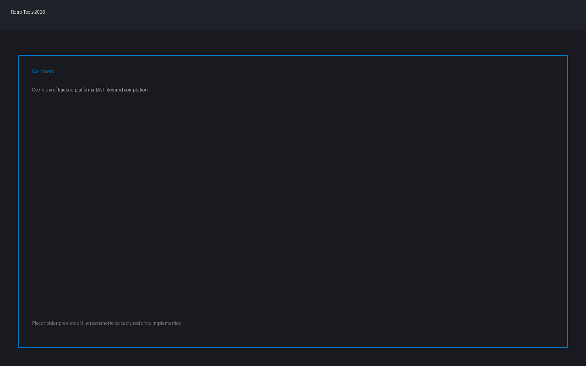
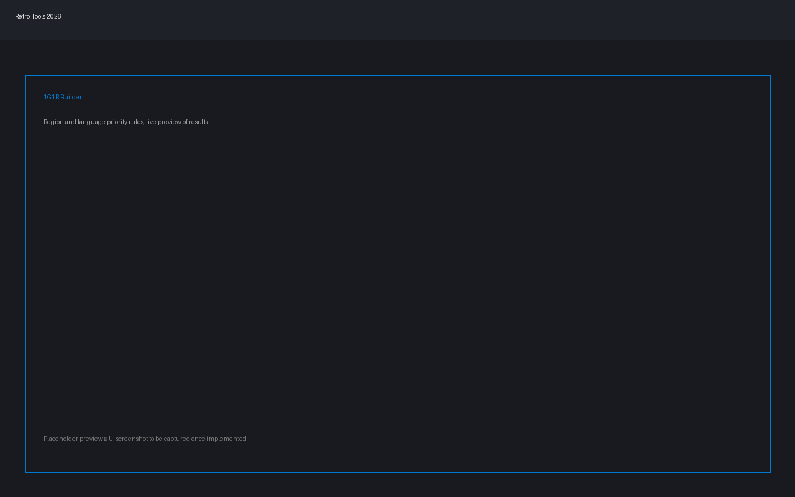

# Retro Tools 2026

A professional-grade 1G1R (1 Game 1 ROM) manager for retro game collections, built in Rust with a native egui/eframe interface. Designed to be the most complete, most polished 1G1R tool available, and built from the ground up to grow into a broader retrogaming toolset.




## Features

- Fast, multi-threaded DAT parsing (No-Intro, Redump, TOSEC, MAME/Logiqx formats)
- Multi-threaded ROM scanning with CRC32 / MD5 / SHA1 / SHA256 hashing, including inside ZIP / 7Z / RAR / CHD archives
- Configurable 1G1R rule engine (region priority, language priority, revision handling, Beta/Proto/Demo/Unlicensed filtering)
- Safe, reversible file operations (copy, move, symlink/hardlink builds) with dry-run mode and undo history
- Modern native desktop UI with light/dark/system themes and a customizable accent color
- Plugin-ready architecture for future retrogaming modules (media scraping, playlists, RetroAchievements, BIOS management, format conversion)
- Command-line interface for automation and scripting, alongside the graphical application

## Getting Started

See [`docs/COMPILATION.md`](docs/COMPILATION.md) for build instructions.

```bash
git clone https://github.com/Patrickjaillet/retrotools26.git
cd retrotools26
cargo build --release
```

The graphical application binary is `retrotools2026`, and the command-line tool is `retrotools-cli`.

## Project Status

Retro Tools 2026 is under active development. See [`docs/CHANGELOG.md`](docs/CHANGELOG.md) for release history.

## Contributing

Contributions are welcome. Please read [`CONTRIBUTING.md`](CONTRIBUTING.md) before opening a pull request, and review the [`CODE_OF_CONDUCT.md`](CODE_OF_CONDUCT.md).

## License

Retro Tools 2026 is distributed under the [MIT License](LICENSE).

Copyright © 2026 Patrick JAILLET — All rights reserved
Contact: sandefjord.development@proton.me
Website: https://patrickjaillet.github.io/retrotools26
Repository: https://github.com/Patrickjaillet/retrotools26
