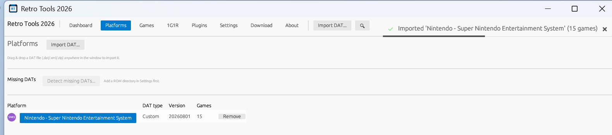
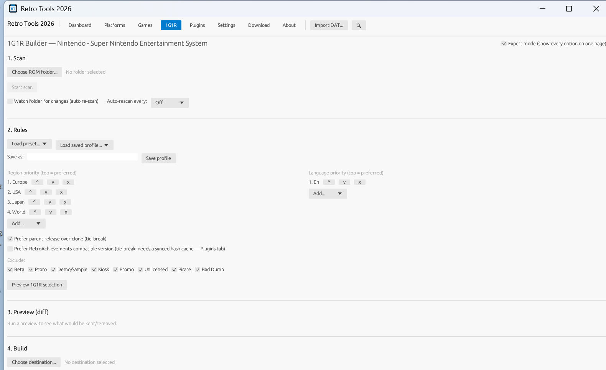

# Retro Tools 2026

**The complete 1G1R collection manager for retro gaming.**

Scan, curate and build a clean "1 Game 1 ROM" collection from your DAT-cataloged ROMs — then export it straight to Batocera, Recalbox, Lakka or EmulationStation, with shaders, controller profiles, box art and RetroAchievements along for the ride.

[Download the latest release](https://github.com/Patrickjaillet/retrotools26/releases/latest) · [Website](https://patrickjaillet.github.io/retrotools26)

---

## What it does

Retro Tools 2026 takes a folder of ROMs and a DAT file (No-Intro, Redump, TOSEC) and gives you back exactly one clean copy of each game — the region and language you asked for, duplicates and bad dumps set aside, nothing guessed. Every step is visible and reversible: preview the selection before anything moves, undo any build afterward.

Beyond the core 1G1R engine, it grows into a full retro gaming toolkit: metadata and box art, save backups, controller profiles, RetroArch shaders, core compatibility notes, disc format conversion, SD/USB card imaging, and RetroAchievements — each one optional, each one off until you turn it on.

## A closer look

<table>
<tr>
<td width="50%">

**Browse and inspect your collection**

Every game at a glance — region, language, size, scan status — with full detail on demand: ROM files, hashes, recommended emulator core, RetroAchievements compatibility.

</td>
<td width="50%">

</td>
</tr>
<tr>
<td width="50%">

**Manage every platform in one place**

Import a DAT, see it listed with its type, version and game count. Missing a DAT for one of your ROM folders? The app finds the gap and offers to fetch it.

</td>
<td width="50%">

</td>
</tr>
<tr>
<td width="50%">

**Full control over the 1G1R rules**

Region and language priority, parent-vs-clone preference, Beta/Proto/Demo/Unlicensed filtering, an optional RetroAchievements-aware tie-break — preview the result before building anything.

</td>
<td width="50%">

</td>
</tr>
</table>

## Everything included

**Core 1G1R engine**
- No-Intro / Redump / TOSEC / MAME DAT parsing
- Multi-threaded scanning and hashing (CRC32/MD5/SHA1/SHA256), including inside ZIP/7Z/RAR/CHD archives
- Configurable region/language priority, revision handling, Beta/Proto/Demo/Unlicensed/Pirate/Bad-Dump filtering
- Preview before you build, full undo history after
- Copy, move, or space-saving symlink/hardlink builds

**Retro ecosystem modules** (each inactive until you turn it on)
- Export a finished set straight into a Batocera/Recalbox/Lakka `roms/` folder, with `es_systems.cfg` merged in
- Box art, screenshots and metadata from ScreenScraper.fr, plus smart ES-DE collections by region/language/genre/year
- Save file & save state backup and restore, fully undoable
- A personal library of RetroArch controller profiles, synced to any device in one pass
- RetroArch shader presets (CRT, scanlines, pixel-art upscalers), assigned per core or per game
- A local core-compatibility advisor flagging which libretro core each game actually needs
- CHD / RVZ / CSO disc image conversion
- SD/USB card imaging with checksum verification and a double-confirmation safety gate before any destructive write
- RetroAchievements-aware: know which of your ROMs are known-compatible before you build

**The essentials**
- Native Windows desktop app (egui) plus a full command-line interface for scripting
- Light/dark/system themes, adjustable UI scale, English/French
- Works fully offline — no account, no telemetry; every third-party credential is yours alone, stored encrypted, never bundled
- Portable mode: run it off a USB stick with zero installation

## Download

Grab the installer or the portable build from the [latest release](https://github.com/Patrickjaillet/retrotools26/releases/latest). Building from source? See [`docs/COMPILATION.md`](docs/COMPILATION.md).

## License

Retro Tools 2026 is distributed under the [MIT License](LICENSE).

Copyright © 2026 Patrick JAILLET — All rights reserved
Contact: sandefjord.development@proton.me · [Website](https://patrickjaillet.github.io/retrotools26) · [Repository](https://github.com/Patrickjaillet/retrotools26)
